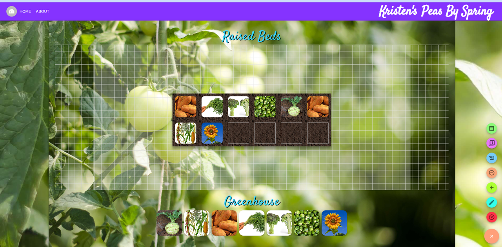

# Peas By Spring

## Description
This application is a tool to plan out your garden using recommended or custom garden layouts, search functionality for plant specimens, and a plant library to import plants into your garden utilizing drag and drop features. 

## Table of Contents

1. [Installation](#installation)
2. [Usage](#usage)
3. [Licenses](#licenses)
4. [Contributing](#contributing)
6. [Questions](#questions)

## Installation
A link to the deployed site can be found [here](https://peas-by-spring.herokuapp.com/). A screenshot of the site is shown below: 

## Usage
To use this site, log in or sign up and navigate to the My Garden using the dropdown menu next to your Peas By Spring. Once you select the dimensions of your garden space, you can use the speed dial to add plants to your workbench space. From there, simply drag the plants to the space in the garden. You can also view the plant specimen information by clicking on a plant in your garden. 

## Licenses
This project uses the MIT license. More info about licenses can be found [here](https://choosealicense.com/).

## Contributing
This project is not open for outside contribution at this time. Thank you for your interest in our project and please feel free to reach out to the development team for more information. The developers also made use of a favicon from [Julie](https://www.favicon.cc/?action=icon&file_id=815736) and several YouTube tutorials such as the layout from [Daily Web Coding](https://www.youtube.com/watch?v=rK0Lz8x7npA) and this one for the [garden layout](https://www.youtube.com/watch?v=YEsE7iWOkc4).

## Questions
The development application can be found on [Github](https://github.com/Axeljk/garden-app-frontend) or contacted through LinkedIn: 
* [Kristen Santee](https://www.linkedin.com/in/kristen-santee-aba1a631/)
* [Axel Kern](https://www.linkedin.com/in/axel-kern/)
* [Akshata Kumbhar](https://www.linkedin.com/in/akshata-kumbhar/)
* [Kit Williams](https://www.linkedin.com/in/kit-williams-webdev/)
